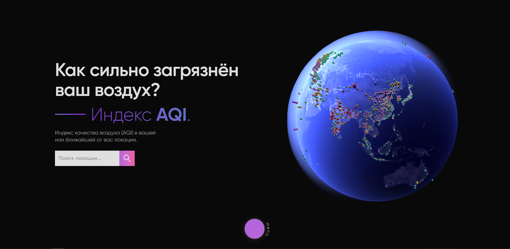

## [Breathing Fine](https://breathing-fine.vercel.app)

Breathing Fine is a simple ReactJS SPA where you can get some basic knowledge about air pollution. This web app also allows you to find important information about the air quality in any location of your choice. That information includes the AQI index, concentration of hazardous chemicals in the air, and a 3-7 day PM2.5 forecast.

### Technologies used
    * ReactJS
    * ThreeJS
    * [AQICN API](https://aqicn.org/api/)
    * [Unsplash API](https://unsplash.com/developers)

### References
    * [WHO](https://www.who.int/ru/news-room/fact-sheets/detail/ambient-(outdoor)-air-quality-and-health)
    * [UNECE](https://unece.org/ru/air-pollution-and-health)
    * [The Guardian](https://www.theguardian.com/environment/2020/apr/11/positively-alpine-disbelief-air-pollution-falls-lockdown-coronavirus)
    * [@mikemarrah on Unsplash](https://unsplash.com/@mikemarrah)
    * [@photoholgic on Unsplash](https://unsplash.com/@photoholgic)
    * [@scutal on Unsplash](https://unsplash.com/@scutal)